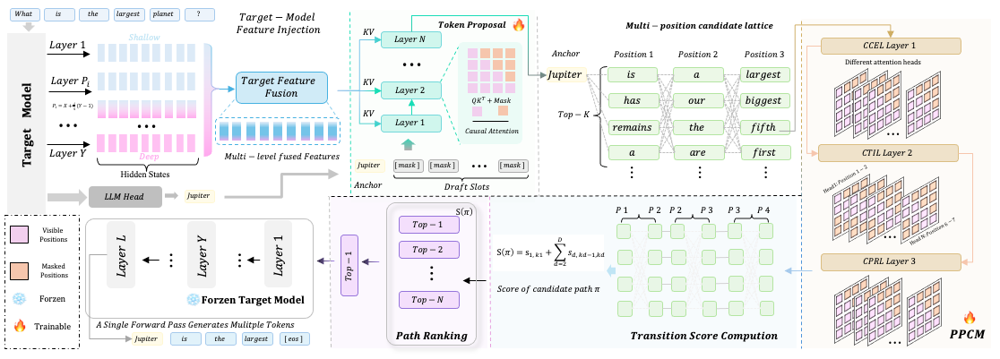
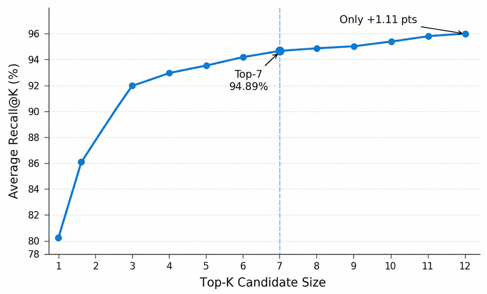
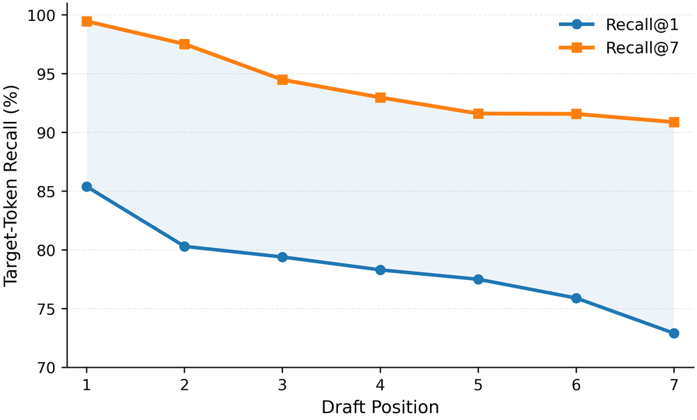

# PPCM

**Many Paths, One Pass: Parallel Causal Modeling for Speculative Decoding**

Parallel drafting predicts multiple future tokens in one forward pass, but independent position-wise predictions weaken intra-block dependencies. We find that candidate generation is not the main bottleneck: the target-model token is covered by the drafter’s **Top-7** candidates in **94.89%** of cases. The remaining problem is composing those candidates into causally consistent paths.

**Parallel Path Causal Modeling (PPCM)** converts temporal autoregressive dependencies into structured visibility constraints and models candidate paths in parallel. At each speculative position, PPCM takes the Top-7 candidates and jointly models adjacent positions with a three-layer encoder:

1. **CCEL** — Causal Context Encoding Layer
2. **CTIL** — Candidate Token Interaction Layer
3. **CPRL** — Causal Path Refinement Layer

CCEL captures causal dependencies across positions, CTIL models interactions among candidates at each position, and CPRL propagates refined representations along the causal direction. All candidates are processed in one forward pass. PPCM then ranks paths and sends the highest-ranked path to the target model for verification.

<p align="center">
  
</p>
<p align="center"><em>PPCM encoder over the Top-7 candidate lattice: CCEL → CTIL → CPRL, then path scoring and target verification.</em></p>

With only **~8.8M** extra parameters, PPCM is evaluated on **two target models** and seven benchmarks (GSM8K, MATH-500, AIME25, HumanEval, MBPP, LiveCodeBench, MT-Bench), draft length **L = 7**.

| | Link |
|---|---|
| Code | [github.com/Xinmu-Tantai/PPCM](https://github.com/Xinmu-Tantai/PPCM) |
| Weights | [huggingface.co/Xinmu7/PPCM](https://huggingface.co/Xinmu7/PPCM) |

## Motivation

Top-7 already covers most target tokens; extra candidates add little recall, so the remaining gap is path consistency rather than candidate generation.

<p align="center">
  
  
</p>
<p align="center"><em>Left: Recall@K saturates at Top-7 (94.89%). Right: Recall@7 stays high across draft positions while Recall@1 drops.</em></p>

## Models

PPCM is reported on:

| Target | Status |
|---|---|
| [Qwen3-8B](https://huggingface.co/Qwen/Qwen3-8B) | Weights released |
| [Qwen3.6-35B-A3B](https://huggingface.co/Qwen/Qwen3.6-35B-A3B) | Weights released |

The public checkpoint is **Qwen3-8B-PPCM** (`PPCMDraftModel`): a 5-layer causal draft plus the PPCM encoder in one `model.safetensors`. Load the Target [Qwen3-8B](https://huggingface.co/Qwen/Qwen3-8B) separately. Speculative length is **7** (`block_size = 8`), tree width **7**.

On Qwen3-8B / GSM8K (T = 0, L = 7), PPCM reaches **τ = 5.97** and **5.18×** speedup with **8.8M** additional parameters (vs DSpark 77.8M / 4.63×). Qwen3.6-35B-A3B uses the same PPCM recipe in the paper; this repo only ships Qwen3-8B weights.


## Usage

```bash
# Target
TARGET_MODEL=Qwen/Qwen3-8B

# Draft + PPCM (Qwen3-8B only)
DRAFT_MODEL=Xinmu7/PPCM

# Must match the released checkpoint
NUM_SPECULATIVE_TOKENS=7
```

Example scripts: `examples/offline_inference/ppcm_profiling_*.sh`. This tree is source-only; build native CUDA extensions before serving.

## Code map

- Encoder: `vllm/model_executor/models/dflash_tree_post_head.py` (`CCEL` → `CTIL` → `CPRL`)
- Loader: `vllm/model_executor/models/qwen3_dflash.py` (draft tensors and `ppcm.*` in the same file)
- Hugging Face class: `ppcm.py` in [Xinmu7/PPCM](https://huggingface.co/Xinmu7/PPCM)

## License

Apache License 2.0. Built on [vLLM](https://github.com/vllm-project/vllm).
